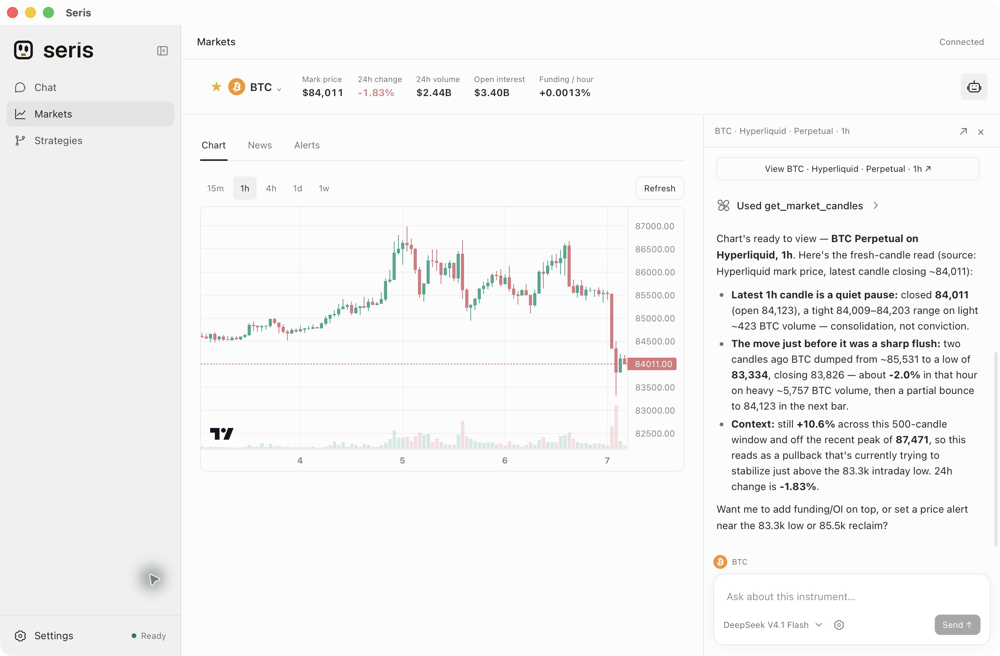
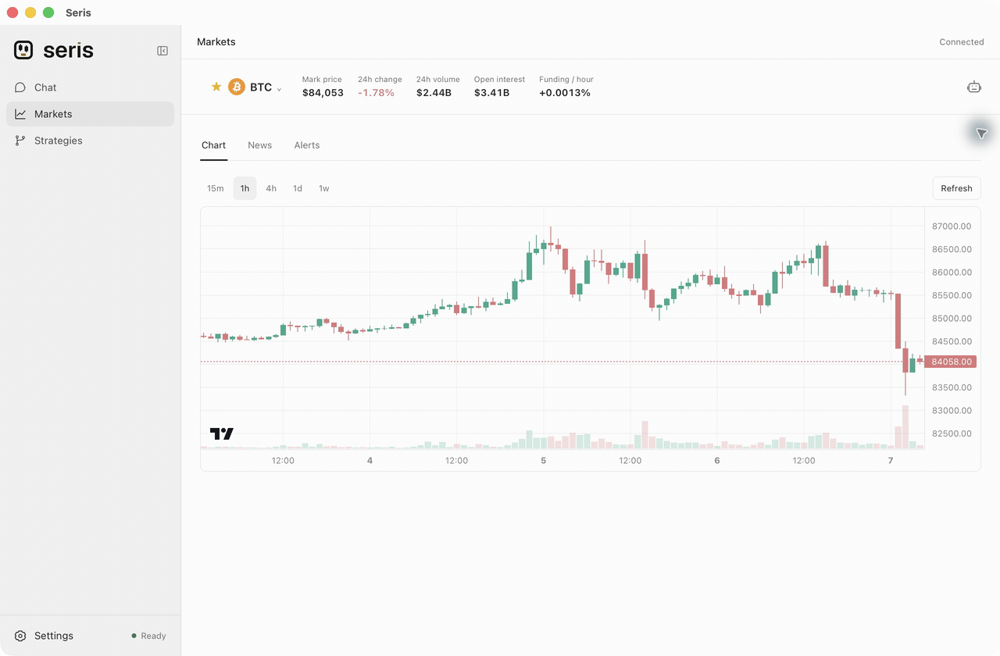
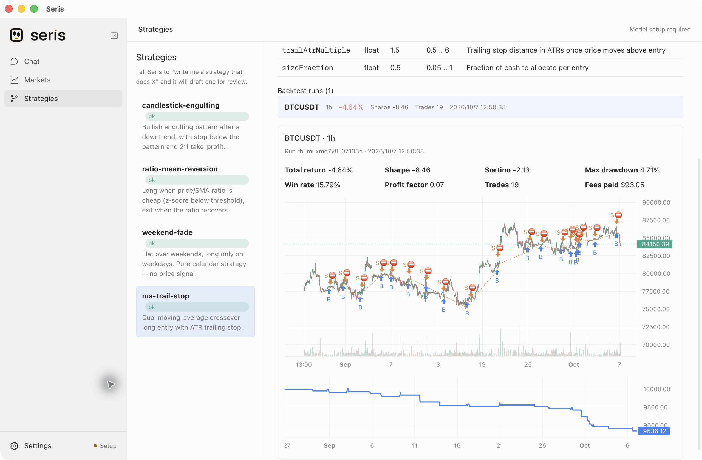

<p align="center">
  <picture>
    <source media="(prefers-color-scheme: dark)" srcset="apps/desktop-ui/public/brand/logos/wordmark-on-dark.svg">
    
  </picture>
</p>

<h1 align="center">Seris — open-source desktop AI trading assistant</h1>

<p align="center">
  Your AI market research desk: talk through a market move, open its chart, and turn an idea into a local backtest.<br>
  Crypto, stocks, ETFs, commodities, FX and indices · bring your own model.
</p>

<p align="center">
  <a href="https://seris.im"><strong>seris.im</strong></a> ·
  <a href="https://github.com/aowang-ai/seris/releases/latest"><strong>Download for macOS</strong></a> ·
  <a href="https://seris.im/docs/">Docs</a> ·
  <a href="https://seris.im/zh/">中文</a> ·
  <a href="#explore-the-markets">Watch the walkthrough</a> ·
  <a href="#development">Build from source</a>
</p>

<p align="center"><strong>v0.1.1 stable</strong> · macOS Apple Silicon · Apache-2.0</p>



*The market workspace, with real Hyperliquid data and a response from a connected DeepSeek model. Captured in the released macOS client.*

## Research in one workspace

| What you want to do | How Seris helps |
| --- | --- |
| **Understand a market move** | Ask in Chat or alongside a chart. Share the current instrument, timeframe and selected range with the agent. |
| **Follow your markets** | Search instruments, build a watchlist, switch candlestick intervals and set conditional price alerts. |
| **Test a strategy idea** | Ask for a TypeScript strategy, review its source before saving, and backtest against historical Binance spot or Hyperliquid perpetual candles. |
| **Use your preferred model** | Connect a cloud provider, a custom OpenAI/Anthropic-compatible endpoint, or a running Ollama or LM Studio server. |

Conversations, watchlists and saved strategies persist across app upgrades. The interface supports English and Chinese.

Choose **Ask every time** or **Allow all actions** below the chat input. The choice applies to that conversation and persists across restarts; new chats start with Ask every time. Tasks can continue through as many model and tool calls as needed, and **Stop** remains available.

## Explore the markets

Search for an instrument, choose its market and change the chart timeframe.



*A shortened walkthrough of the actual client. NVDA is shown as a Hyperliquid xyz perpetual contract; quotes in this recording are historical snapshots.*

Open the assistant beside a chart to discuss what you see. For example:

> Summarize this chart in three short bullets.
>
> Compare BTC funding on Hyperliquid and Binance.
>
> Alert me when BTC crosses $90,000.

## Inspect a strategy, then its results

Review the strategy's code and parameters, then inspect its return, drawdown, fees, trade markers and equity curve. Backtest runs remain available in **Strategies**.



*The bundled moving-average strategy, run locally against 999 closed Binance BTCUSDT hourly candles. These are simulated historical results.*

Try this in Chat:

> Write a BTC strategy that enters on a moving-average crossover and uses an ATR trailing stop.
>
> Backtest ma-trail-stop on Hyperliquid BTC 1h for the last 14 days.

Hyperliquid backtests use closed candles, including HIP-3 instruments such as `xyz:NVDA`. Its API provides only the latest 5,000 candles and does not support 6h intervals; Seris rejects unavailable windows instead of silently shortening them. Results record the venue, date range, fees and slippage. These are price-only simulations: funding payments, leverage and liquidation are not included.

## Get started

1. **Install Seris.** Download the Apple Silicon DMG from [the latest release](https://github.com/aowang-ai/seris/releases/latest), open it, and drag Seris to Applications.
2. **Connect a model.** Open **Settings → Models**, configure a provider and select a default model. For Ollama or LM Studio, start the local server first.
3. **Start researching.** Ask in Chat, or open **Markets** and bring the assistant alongside your chart.

**First launch on macOS:** Seris is ad-hoc signed and is not Apple-notarized. If macOS blocks the first launch, open **System Settings → Privacy & Security → Open Anyway** and approve Seris. See [Apple's instructions](https://support.apple.com/102445).

For upgrades, quit the old app before replacing it. Your local data is retained; macOS may ask you to authorize access to an existing model credential again.

## Models, data and local storage

**Bring your own model.** Seris supports cloud providers and local models through Ollama or LM Studio, including custom endpoints. Model requests go to the provider you configure and use its pricing and data policies. Desktop API keys are saved in the operating system credential store.

**Know the data source.** Public market data comes from Hyperliquid, Binance spot, Binance traditional-finance perpetuals and Hyperliquid xyz. Stock, ETF, commodity, FX and index instruments on perpetual venues show contract prices. For US stocks and ETFs, connect Longbridge from Markets and complete browser authorization; access depends on your account permissions. Crypto news requires `CRYPTOCOMPARE_API_KEY` in the startup environment.

**Keep your workspace.** Conversations, watchlists, strategies and backtest results are stored locally. Approved browser and terminal tools can use your local environment; see [Security](SECURITY.md) for the permission model.

**Release scope.** v0.1.1 supports Chat, Markets, model settings and local strategy backtests on macOS Apple Silicon. Alerts run while the app is running. Live order execution, wallet transfers and connected portfolio balances are unavailable. Windows, Linux and Intel Mac installers are not included in this release.

## Development

Use the Node version in [`.node-version`](.node-version), **pnpm 12.5.1**, Rust and the Tauri build prerequisites for your operating system.

```bash
pnpm install --frozen-lockfile
pnpm tauri:dev
```

```bash
pnpm typecheck
pnpm test        # Existing regression checks, when needed
pnpm tauri:build
```

| Directory | Role |
| --- | --- |
| [`apps/core`](apps/core) | Agent runtime, local gateway, tools, skills and persistent sessions |
| [`apps/desktop-ui`](apps/desktop-ui) | React, Vite and Tailwind interface |
| [`apps/desktop`](apps/desktop) | Tauri/Rust shell and desktop packaging |

See [Contributing](CONTRIBUTING.md) for gateway development, local data paths and release checks. Found a problem? [Open an issue](https://github.com/aowang-ai/seris/issues) with your app version and reproduction steps.

## License

Project-owned code and public documentation use [Apache-2.0](LICENSE). Seris branding has [separate terms](apps/desktop-ui/public/brand/LICENSE.md); dependencies retain their own licenses.
